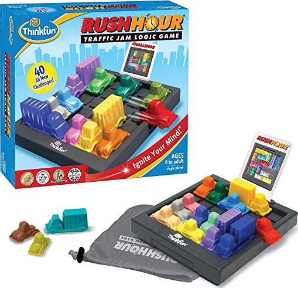
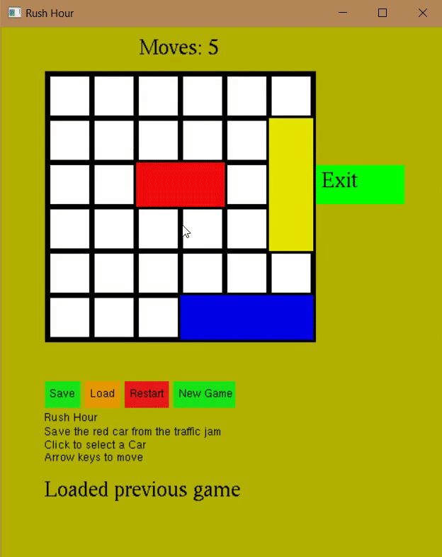

# Rush Hour Game

The classic board game recreated in `C++` using OpenGL

# [Download (windows only)](https://github.com/SleekPanther/rush-hour-game/releases/latest)

Unfortunately I can't compile code for Mac

## Demo

## Code Notes
- All board setups are stored in vectors as a list of integers, but can also be read from their respective file
  - 1st line is [number of horizontal vehicles] followed by [number of vertical vehicles]
  - Next number is [length of the special vehicle] (how many coordinate pairs)
  - Then the coordinates of the special vehicle one 1 line (e.g for `length=2`, coordinates are: x1 y1 x2 y2)
  - Then [length of the 1st horizontal vehicle]
  - Followed by its coordiantes
  - Then the vertical vehicles, length followed by their coordinates
- The current moves & vehicle positions are saved to the progress file: `.delete_this_file_if_program_dies`  
  Sometimes the whole program will crash & `vector` will go out of bounds if the file is corrupted
  Simply delete it & the program will create a new one
  - The 1st line in the **Progress file** is the previous score, all following lines follow the pattern outlined above
